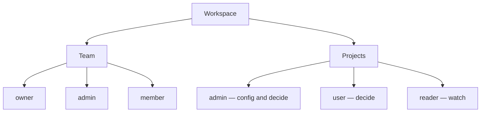

The org is the membership tree: one **workspace**, a **team**, and **projects** that each map to one origin. Roles decide who sees work, who can decide, and who can change config.

## Workspace

A workspace is the org. Create one on first sign-in. Switch workspaces when you belong to more than one.

Invite people at **Settings → Team**. Workspace roles:

| Role | Who | What they can do |
| --- | --- | --- |
| `owner` | Workspace creator | Full admin, including team |
| `admin` | Invited | Same as owner for settings, projects, and team (cannot remove the owner) |
| `member` | Invited | Only the projects they are added to |

Workspace admins see every project. Members only see projects they are on. Project admins cannot invite people to the workspace — that stays on Team.

Default timezone and SLA live on the workspace (**Settings → Workspace**).

## Projects

A [project](/docs/projects) is one origin: Mastra, Hermes, HTTP, LangGraph, or Temporal. Add workspace members on the **People** tab with a project role.

| Role | Config | Decide | Appear in inbox |
| --- | --- | --- | --- |
| `admin` | Yes | Yes | Yes |
| `user` | No | Yes | Yes |
| `reader` | No | No | Yes (watch only) |

`admin` and `user` can Accept / Reject / Edit when `allowedActions` allows it. `reader` cannot decide and cannot receive a [delegated](/docs/inbox) item.

The project's default **assignee** is who gets the work item (and email / push) unless a rule says otherwise.

## Rules

**Rules** are first-match. Lower priority number runs first. Match on action name (glob, for example `send-*`) and/or workflow id. A matching rule can set SLA minutes and notification channels.

Until team routing lands, assignee overrides on rules are ignored; SLA and channel still apply. With no rules, the project default SLA and email channel apply.

## Accountability

- **Delegate** reassigns an open work item to another person who can decide, and emails them.
- **Logs** on the project record ingest, notify, decide, and resume.
- Closed items and audit events are retained per workspace plan; self-hosted keeps them. See [Inbox](/docs/inbox) and [Self-host](/docs/self-host).

The [inbox](/docs/inbox) is the review surface for every visible project. Origins pause; they do not own the decision or the audit trail.
