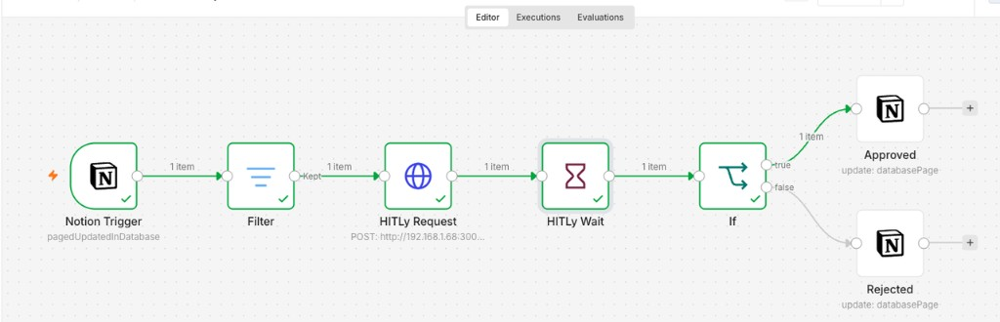
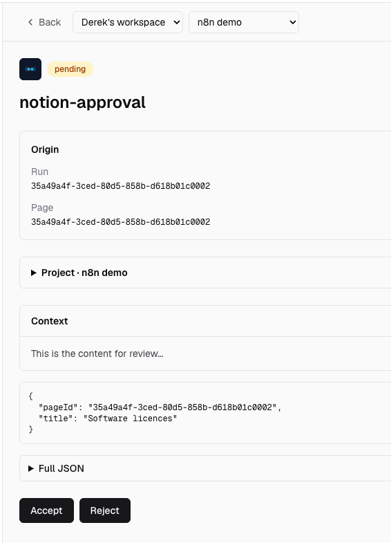

# n8n → Hitly (HTTP)

Hand-roll a **Wait** node against a Hitly **HTTP** project. There is no custom n8n node in v1.

Create the project in Hitly with plugin **HTTP**. Copy `HITLY_API_URL`, `HITLY_PROJECT_ID`, and a project API key.

Set `WEBHOOK_URL` on self-hosted n8n to a host Hitly can reach. Resume URLs must not be `localhost` unless Hitly runs on the same machine.

## One workflow, one execution

Keep ingest and resume on **one connected chain**. Do not add a second Webhook trigger on the same canvas.

```
Notion Trigger → Filter → HTTP Request (Hitly) → Wait → IF → Notion Approved
                                                         └→ Notion Rejected
```

A disconnected Webhook node is a **different workflow**. Executing from Notion Trigger never starts it. Hitly then POSTs to `/webhook-test/...` or `/webhook/...` and n8n returns 404 (`webhook is not registered`).

The Wait node’s URL is `$execution.resumeUrl` (`/webhook-waiting/...`). It stays registered while that execution is paused.



## Nodes

1. **Notion Trigger** — page updated in the database (or Status becomes In review, via Filter).

2. **Filter** (optional) — keep only pages that should create a Hitly item.

3. **HTTP Request** — `POST {HITLY_API_URL}/api/v1/approvals`

   URL is that path only. **Send Query Parameters** off. **Send Body** on, content type JSON.

   Headers:

   - `Authorization: Bearer hitly_...`
   - `Content-Type: application/json`
   - `Idempotency-Key: {{ $json.id }}` (Notion page id)

   Body:

   ```json
   {
     "plugin": "http",
     "projectId": "prj_...",
     "runId": "{{ $json.id }}",
     "actionName": "notion-approval",
     "contextMarkdown": "{{ $json.Name }}",
     "metadata": {
       "pageId": "{{ $json.id }}",
       "title": "{{ $json.Name }}"
     },
     "resumeUrl": "{{ $execution.resumeUrl }}"
   }
   ```

   `resumeUrl` must be `$execution.resumeUrl`, not the Webhook node’s test or production URL.

4. **Wait** — Resume **On Webhook Call**. Place it **after** the HTTP Request. Limit wait time above your Hitly SLA.

   Hitly POSTs:

   ```json
   {
     "decision": "accept",
     "id": "apr_...",
     "metadata": {
       "pageId": "…",
       "title": "…"
     }
   }
   ```

   After Wait, `$json.decision` and `$json.metadata.pageId` are the Hitly body. The Notion trigger’s page is still `$('Notion Trigger').item.json.id`.

5. **IF** — `{{ $json.decision }}` is `accept` (true) vs `reject` (false).

6. **Notion** update page — Status **Approved** on true, **Draft** on false. Page id: `{{ $json.metadata.pageId }}` or `{{ $('Notion Trigger').item.json.id }}`.



## Test vs production

| Mode | What to do |
| --- | --- |
| Editor test | Execute the workflow **from Notion Trigger** (or wait for a real Notion event while the editor is listening). Do not click Listen on a separate Webhook node. |
| Production | **Activate** the workflow. Notion Trigger and Wait both run without the editor open. |

If Hitly shows `HTTP resume failed (404)` with `webhook is not registered`, ingest used a Webhook URL instead of `$execution.resumeUrl`, or the workflow is inactive and the Wait never started.

## Notes

- Ingest `plugin` must be `"http"` and must match the Hitly project.
- Adapter: `@hitly/plugin-http`. Guide: [hitly.net/integrations/n8n](https://hitly.net/integrations/n8n).
- Notion Status mapping: [`examples/notion`](../notion/notion.md).
