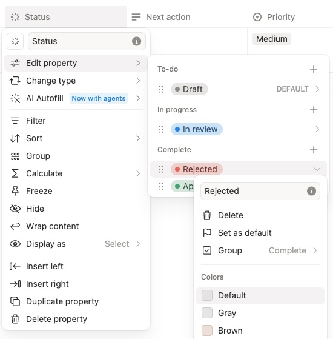
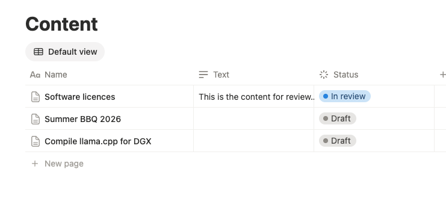

# Notion → Hitly (HTTP)

Notion has no Approvals API. Use a Status property and the generic [HTTP](https://hitly.net/integrations/http) adapter.

Suggested mapping (names must already exist on the database Status property):

| Notion Status | Hitly |
| --- | --- |
| **In review** | create an inbox item |
| Hitly `accept` | PATCH Status **Approved** |
| Hitly `reject` | PATCH Status **Draft** |



A template such as [Approval Workflow Tracker](https://www.notion.com/en-gb/templates/approval-workflow-tracker) is only a schema example. Hitly does not own the option names.

Notion automations are fire-and-forget. They cannot wait on a `resumeUrl`. Something in the middle must own the callback (n8n, Make, Zapier, or a tiny HTTP handler).

Database **Send webhook** actions need a [paid Notion plan](https://www.notion.com/help/webhook-actions).

## Loop

```
Status → In review
  → Notion automation POSTs to glue
  → glue POSTs Hitly ingest (plugin: http, resumeUrl, metadata)
  → reviewer decides
  → Hitly POSTs { decision, id, metadata } to resumeUrl
  → glue PATCHes Notion Status Approved or Draft
```

Do **not** add a second Notion automation on **Approved** that POSTs back to Hitly. That re-ingests the same page.

## 1. Hitly project

Create a project with plugin **HTTP**. Copy the API key.

## 2. Notion automation (ingest trigger)

On the requests database:

- Trigger: Status becomes **In review**
- Action: Send webhook to the **glue** URL (not straight to Hitly unless the glue already minted a `resumeUrl`)
- Include page id, title, requester, and a Notion URL
- Paid-plan automations only send selected properties, not page body

Use the Notion page id as Hitly `runId` and `Idempotency-Key` so retries do not duplicate **open** cards. After reject or cancel, the same page id creates a new item.



## 3. Glue ingest

The callback host POSTs `POST {HITLY_API_URL}/api/v1/approvals`:

```json
{
  "plugin": "http",
  "projectId": "prj_...",
  "runId": "notion-page-id",
  "actionName": "notion-approval",
  "args": { "title": "..." },
  "metadata": { "pageId": "notion-page-id", "title": "..." },
  "contextMarkdown": "Request title and selected properties.",
  "resumeUrl": "https://your-callback.example/hitly-resume"
}
```

`Authorization: Bearer hitly_...`. `Idempotency-Key: notion-page-id`.

In n8n this is **Send Body** JSON, not query parameters. A request dump with `"json": false` and fields under `qs` will 400.

## 4. Glue resume (write Status back)

Hitly POSTs to `resumeUrl`:

```json
{
  "decision": "accept",
  "id": "apr_...",
  "metadata": { "pageId": "notion-page-id", "title": "..." }
}
```

Use `$json.metadata.pageId` to PATCH that Notion page.

```http
PATCH https://api.notion.com/v1/pages/{page_id}
Authorization: Bearer ntn_...
Notion-Version: 2025-09-03
Content-Type: application/json
```

```json
{ "properties": { "Status": { "status": { "name": "Approved" } } } }
```

Use `"Draft"` when `decision` is `reject`. Expire/cancel can map to **Draft** or leave **In review**.

The Notion connection must be shared on the database. Status options must already exist.

## 5. n8n as glue

One connected chain (see [`n8n recipe`](../n8n/n8n.md)):

```
Notion Trigger → Filter → HTTP Request (Hitly, resumeUrl: $execution.resumeUrl) → Wait → IF → Notion PATCH
```

Do not put a second Webhook node on the canvas. That URL 404s unless you click Listen (test) or activate a workflow that starts on Webhook. Wait uses `$execution.resumeUrl` (`/webhook-waiting/...`) on the same execution, so the Notion page id is still on the trigger node.

Activate the workflow for production. Notion cannot POST to localhost; Hitly must be able to reach `WEBHOOK_URL`.


## Related

- Adapter: `@hitly/plugin-http`
- Guide: [hitly.net/integrations/http](https://hitly.net/integrations/http)
